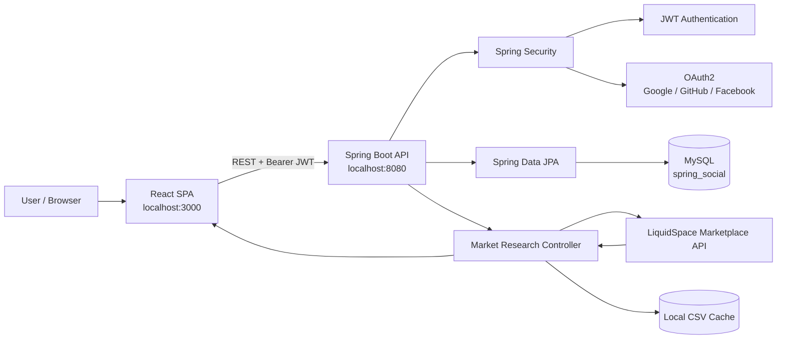
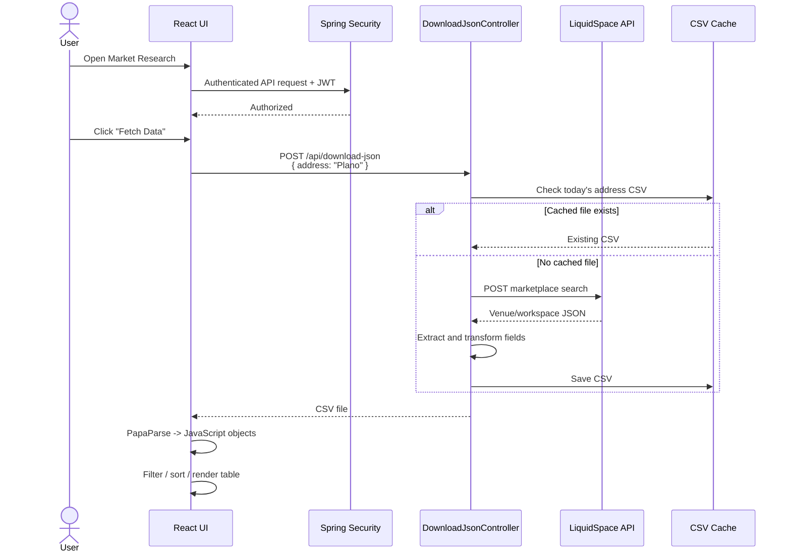
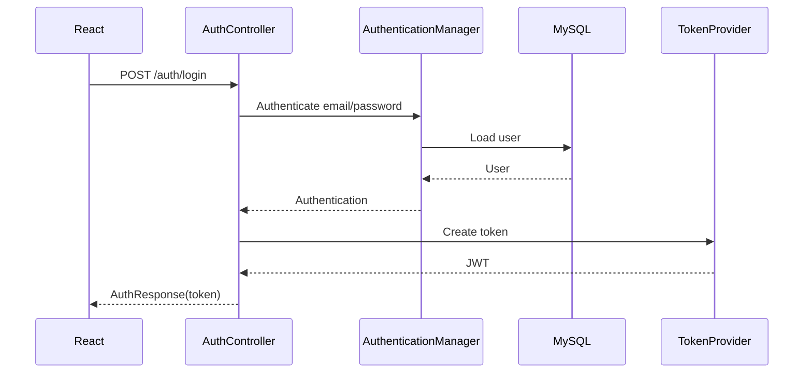
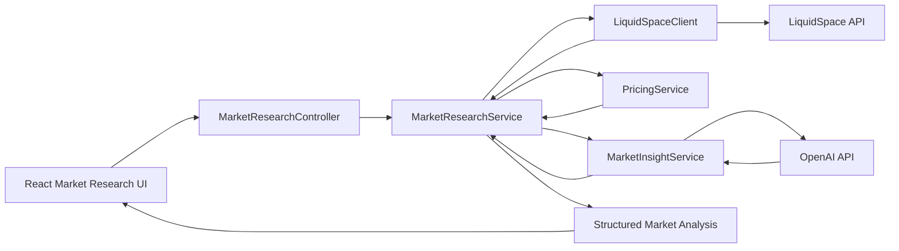

# MarketResearch

[](https://openjdk.org/)
[](https://spring.io/projects/spring-boot)
[](https://react.dev/)
[](https://www.mysql.com/)
[](https://oauth.net/2/)
[](#license)

**MarketResearch** is a full-stack coworking-space market research and pricing application built with **React**, **Spring Boot**, **Spring Security**, **OAuth2/JWT**, and **MySQL**.

The application retrieves coworking-space marketplace data from the **LiquidSpace Marketplace API**, transforms the response into a simplified market dataset, and presents it in an authenticated React UI where users can filter, sort, and compare venue and workspace pricing.

> [!IMPORTANT]
> The current `main` branch does **not** contain an active OpenAI API integration.  
> The **OpenAI Integration** section below documents the recommended extension point for AI-assisted pricing, competitor analysis, and market intelligence.

---

## Table of Contents

- [Architecture](#architecture)
- [Application Flow](#application-flow)
- [Project Structure](#project-structure)
- [Technology Stack](#technology-stack)
- [Features](#features)
- [Market Research Flow](#market-research-flow)
- [Authentication and Security](#authentication-and-security)
- [API Examples](#api-examples)
- [Local Setup](#local-setup)
- [Configuration](#configuration)
- [OpenAI Integration](#openai-integration)
- [Security Notes](#security-notes)
- [Recommended Improvements](#recommended-improvements)
- [License](#license)

---

## Architecture



The application is organized as two independently running applications:

- **React frontend** on `localhost:3000`
- **Spring Boot backend** on `localhost:8080`

The backend owns authentication, authorization, database access, third-party API integration, data transformation, and file-based market-data caching.

---

## Application Flow



---

## Project Structure

```text
MarketResearch/
├── README.md
│
├── react-social/                         # React frontend
│   ├── package.json
│   └── src/
│       ├── app/
│       │   └── App.js                    # Main routing
│       ├── common/
│       │   ├── AppHeader.js
│       │   ├── PrivateRoute.js
│       │   └── LoadingIndicator.js
│       ├── constants/
│       │   └── index.js                  # Backend/OAuth URLs
│       ├── user/
│       │   ├── login/
│       │   ├── signup/
│       │   ├── profile/
│       │   ├── oauth2/
│       │   └── MarketResearch/
│       │       └── MarketResearch.js     # Market research UI
│       └── util/
│           └── APIUtils.js               # Common REST calls
│
└── spring-social/                        # Spring Boot backend
    ├── pom.xml
    ├── downloads/                        # Generated/cached market data
    └── src/
        ├── main/
        │   ├── java/com/example/springsocial/
        │   │   ├── SpringSocialApplication.java
        │   │   ├── config/
        │   │   │   ├── AppProperties.java
        │   │   │   ├── SecurityConfig.java
        │   │   │   └── WebMvcConfig.java
        │   │   ├── controller/
        │   │   │   ├── AuthController.java
        │   │   │   ├── UserController.java
        │   │   │   └── DownloadJsonController.java
        │   │   ├── model/
        │   │   ├── payload/
        │   │   ├── repository/
        │   │   └── security/
        │   │       └── oauth2/
        │   └── resources/
        │       └── application.yml
        └── test/
```

---

## Technology Stack

| Layer | Technology |
|---|---|
| Frontend | React, React Router, Axios, PapaParse |
| Backend | Java 11, Spring Boot 2.5.5 |
| API | Spring MVC / REST |
| Security | Spring Security, OAuth2, JWT, BCrypt |
| Database | MySQL |
| Persistence | Spring Data JPA / Hibernate |
| External Market Data | LiquidSpace Marketplace API |
| Serialization | Jackson |
| Build | Maven / npm |
| Market-data cache | Local CSV files |

---

## Features

- User registration and local login
- JWT-based stateless authentication
- OAuth2 login with Google, GitHub, and Facebook
- Protected React routes
- Coworking-space market-data retrieval
- LiquidSpace Marketplace API integration
- JSON-to-CSV transformation
- Address/date-based local market-data caching
- CSV parsing in React using PapaParse
- Interactive filtering
- Interactive column sorting
- Workspace and pricing comparison
- Extensible architecture for AI-assisted market intelligence

---

## Market Research Flow

The primary frontend implementation is:

```text
react-social/src/user/MarketResearch/MarketResearch.js
```

The React application sends:

```http
POST http://localhost:8080/api/download-json
Authorization: Bearer <JWT>
Content-Type: application/json
```

Example request:

```json
{
  "address": "Plano"
}
```

The backend endpoint is implemented in:

```text
spring-social/src/main/java/com/example/springsocial/controller/DownloadJsonController.java
```

The controller calls the LiquidSpace Marketplace API and extracts fields including:

```text
venue.name
venue.address
venue.workspaceTypesFormatted
workspace.spaceTypeFormatted
workspace.price
workspace.priceDescription
```

The backend writes the transformed records to CSV and returns the file to React.

React then performs:

```text
CSV Blob
   ↓
FileReader
   ↓
PapaParse
   ↓
JavaScript Objects
   ↓
Filter + Sort
   ↓
HTML Table
```

### Data caching

Generated files use an address/date naming convention similar to:

```text
address-Plano-20250102.csv
```

If the file already exists for the requested address and date, the backend returns the cached file rather than calling the external API again.

---

## Authentication and Security

### Local authentication



### OAuth2 authentication

Supported providers:

- Google
- GitHub
- Facebook

High-level flow:

```text
React
  ↓
/oauth2/authorize/{provider}
  ↓
Spring Security OAuth2
  ↓
Provider authentication
  ↓
/oauth2/callback/{provider}
  ↓
CustomOAuth2UserService
  ↓
OAuth2AuthenticationSuccessHandler
  ↓
JWT
  ↓
React /oauth2/redirect
```

Protected API calls include the token as:

```http
Authorization: Bearer <access-token>
```

---

## API Examples

### Sign up

```bash
curl -X POST http://localhost:8080/auth/signup \
  -H "Content-Type: application/json" \
  -d '{
    "name": "Demo User",
    "email": "demo@example.com",
    "password": "change-me"
  }'
```

### Login

```bash
curl -X POST http://localhost:8080/auth/login \
  -H "Content-Type: application/json" \
  -d '{
    "email": "demo@example.com",
    "password": "change-me"
  }'
```

Example response:

```json
{
  "accessToken": "<jwt-token>",
  "tokenType": "Bearer"
}
```

### Current user

```bash
curl http://localhost:8080/user/me \
  -H "Authorization: Bearer <jwt-token>"
```

### Fetch coworking-space market data

```bash
curl -X POST http://localhost:8080/api/download-json \
  -H "Authorization: Bearer <jwt-token>" \
  -H "Content-Type: application/json" \
  -d '{
    "address": "Plano"
  }' \
  --output market-research.csv
```

---

## Local Setup

### Prerequisites

Install:

- Java 11
- Maven
- Node.js / npm
- MySQL
- Git

### 1. Clone the repository

```bash
git clone https://github.com/Mahendira/MarketResearch.git
cd MarketResearch
```

### 2. Create the MySQL database

```sql
CREATE DATABASE spring_social;
```

### 3. Configure the backend

Configure database and authentication values using environment variables or a local configuration file that is **not committed to Git**.

Example environment variables:

```bash
export DB_URL=jdbc:mysql://localhost:3306/spring_social
export DB_USERNAME=root
export DB_PASSWORD=your-password

export JWT_SECRET=your-long-random-secret

export GOOGLE_CLIENT_ID=...
export GOOGLE_CLIENT_SECRET=...

export GITHUB_CLIENT_ID=...
export GITHUB_CLIENT_SECRET=...

export FACEBOOK_CLIENT_ID=...
export FACEBOOK_CLIENT_SECRET=...

export LIQUIDSPACE_API_KEY=...
```

### 4. Run the Spring Boot backend

```bash
cd spring-social
mvn spring-boot:run
```

Backend:

```text
http://localhost:8080
```

### 5. Run the React frontend

Open another terminal:

```bash
cd react-social
npm install
npm start
```

Frontend:

```text
http://localhost:3000
```

---

## Configuration

The React frontend currently expects:

```javascript
API_BASE_URL = 'http://localhost:8080'
OAUTH2_REDIRECT_URI = 'http://localhost:3000/oauth2/redirect'
```

For local OAuth2 development, register callback URLs such as:

```text
http://localhost:8080/oauth2/callback/google
http://localhost:8080/oauth2/callback/github
http://localhost:8080/oauth2/callback/facebook
```

The application redirect after successful OAuth2 authentication is:

```text
http://localhost:3000/oauth2/redirect
```

---

# OpenAI Integration

## Current state

The current `main` branch uses **LiquidSpace as the external market-data provider**.

There is currently no OpenAI client, OpenAI REST call, Spring AI dependency, or OpenAI API key usage in the application source.

OpenAI is therefore best treated as the **next market-intelligence layer**, rather than as part of the existing data-acquisition flow.

## Recommended AI architecture



The OpenAI API should be called only from the Spring Boot backend so the API key is never exposed to the browser.

### Suggested package structure

```text
controller/
  MarketResearchController.java

service/
  MarketResearchService.java
  PricingService.java
  MarketInsightService.java

client/
  LiquidSpaceClient.java
  OpenAIClient.java

dto/
  MarketResearchRequest.java
  MarketResearchResponse.java
  VenueDTO.java
  WorkspaceDTO.java
  MarketInsightDTO.java
```

### Recommended OpenAI responsibilities

OpenAI should augment structured market calculations rather than replace them.

Good use cases include:

- Summarizing the Plano coworking market
- Explaining pricing differences among venues
- Identifying likely premium and value competitors
- Generating competitor summaries
- Explaining pricing anomalies
- Suggesting target customer segments
- Producing market-entry recommendations
- Turning calculated statistics into executive-level insights

Deterministic calculations such as median price, average price, price per workspace type, ranking, and percentage differences should remain in normal Java business logic.

### Example AI request

A backend service could construct a prompt from normalized market data:

```text
You are analyzing coworking-space pricing.

Market: Plano, Texas

Use the supplied venue and workspace pricing data to:
1. summarize the competitive market,
2. identify high and low pricing outliers,
3. describe likely positioning,
4. recommend a competitive price range,
5. explain the recommendation using only the supplied data.
```

### Example structured response

```json
{
  "market": "Plano",
  "venueCount": 18,
  "medianPrivateOfficePrice": 625,
  "recommendedPriceRange": {
    "minimum": 575,
    "maximum": 650
  },
  "aiInsight": {
    "marketPosition": "mid-market",
    "summary": "The market contains a mix of flexible and premium coworking offerings...",
    "competitors": [
      {
        "name": "Example Venue",
        "position": "premium"
      }
    ],
    "recommendation": "A starting price near the market median provides..."
  }
}
```

### Recommended configuration

Never hard-code the OpenAI API key.

Use:

```bash
export OPENAI_API_KEY=...
```

For Spring configuration:

```yaml
openai:
  api-key: ${OPENAI_API_KEY}
```

A production implementation should also add:

- Request timeouts
- Retry/backoff rules
- Token/cost limits
- Structured JSON output validation
- Prompt/version management
- Logging without sensitive prompt data
- Metrics for latency, errors, and token usage
- Graceful fallback when the LLM is unavailable

---

## Security Notes

> [!WARNING]
> Never commit passwords, OAuth client secrets, JWT signing secrets, marketplace API keys, or OpenAI keys to Git.

Before deploying this project:

1. Rotate any credentials that were previously committed.
2. Remove secrets from tracked configuration.
3. Use environment variables or a secret manager.
4. Enable GitHub secret scanning where available.
5. Use separate credentials for local, test, and production environments.
6. Consider removing sensitive values from Git history where appropriate.
7. Restrict CORS to required production origins.
8. Use HTTPS in deployed environments.

---

## Recommended Improvements

### Application architecture

Refactor the market-research logic out of `DownloadJsonController` into dedicated controller, service, client, mapper, and DTO layers.

```text
Controller
   ↓
MarketResearchService
   ├── LiquidSpaceClient
   ├── PricingService
   ├── MarketInsightService
   └── MarketResearchRepository / Cache
```

### API design

Instead of returning a CSV blob to React, consider returning structured JSON:

```http
POST /api/market-research
```

```json
{
  "location": "Plano"
}
```

Response:

```json
{
  "location": "Plano",
  "venues": [],
  "statistics": {},
  "insights": {}
}
```

CSV export can then become a separate endpoint:

```http
GET /api/market-research/{id}/export
```

### Additional enhancements

- OpenAI-powered market insights
- Pricing engine with deterministic statistics
- Historical price tracking
- Multi-city comparison
- MySQL-backed market datasets
- Redis caching
- API rate limiting
- Swagger / OpenAPI documentation
- Docker support
- Kubernetes deployment
- GitHub Actions CI/CD
- Unit and integration tests
- Mock external API testing
- Centralized logging
- Metrics and tracing
- Dashboard charts
- Scheduled data refresh

---

## Development Roadmap


---

## License

No license is currently specified for this repository.

If this project will be distributed publicly or reused by others, add an appropriate `LICENSE` file and update the badge at the top of this README.

---

## Project Goal

The long-term goal of MarketResearch is to evolve from a coworking marketplace-data viewer into an intelligent **pricing and market-analysis platform** that combines:

**Marketplace Data + Deterministic Pricing Analytics + Historical Trends + Generative AI Insights**

to support better workspace pricing and market-entry decisions.
